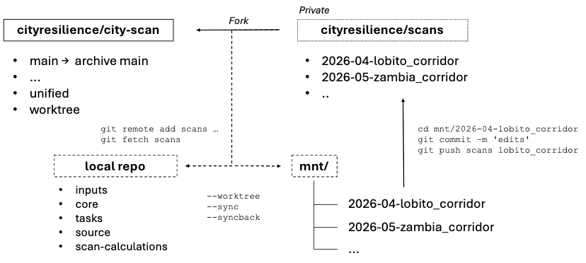

# Scan sharing

How the team shares per-scan customizations using git, instead of manual file copying.

Two repos:
- `cityresilience/city-scan` — main code. Canonical branch is `unified`. (Old `main` is being archived as `archive-main`.)
- `cityresilience/scans` — fork of city-scan. Holds one branch per `mnt/<scan-id>/`. Forked off `worktree`.

Each scan in `mnt/` is a git worktree of the scans repo, on a branch named after the scan-id (e.g. `2026-04-lobito_corridor`).




## 1. One-time setup

Add the scans repo as a remote:

```bash
cd ~/Documents/Work/city-scan-automation
git remote add scans https://github.com/cityresilience/scans.git
git fetch scans
```


## 2. Get a scan into `mnt/`

Three ways depending on starting state.

### a. New scan from scratch

```bash
scan --all --worktree
```

Creates the branch `<scan-id>` in scans (off `worktree`), runs `git worktree add mnt/<scan-id>`, then collection/analysis. The mnt folder is a worktree from the start — no `cp -r`.

### b. Pull a teammate's scan you don't have yet

```bash
git fetch scans
git worktree add -b <scan-id> mnt/<scan-id> scans/<scan-id>
```

Data dirs (`01-/02-/03-`) are gitignored — regenerate via `scan --all` or pull from GCS.

### c. Migrate an existing cp-r scan

```bash
scan --worktree <scan-id>
```

Renames the existing folder aside, creates the branch + worktree, moves `01-/02-/03-/.here` back into the new worktree. Local data is preserved.


## 3. Edit + push

Inside a scan worktree, commits go to that scan's branch:

```bash
cd mnt/2026-04-lobito_corridor
git add .
git commit -m "tune flood breaks"
git push scans 2026-04-lobito_corridor
```

The main folder (on `unified`) is unaffected by edits inside the worktree.


## 4. Sync between scan and `unified`

### a. Pull `unified` updates into a scan

When `cityresilience/city-scan/unified` has new commits and you want them in your scan:

```bash
# local unified catches up
git fetch city-scan
git checkout unified
git pull city-scan unified

# scans fork's worktree branch needs to be in sync (only if stale)
git push scans unified:worktree
# or use GitHub's "Sync fork" on cityresilience/scans

# inside the scan worktree, merge worktree branch into the scan branch
cd mnt/<scan-id>
git merge worktree
git push scans <scan-id>
```

Per-scan, on-demand. Dormant scans don't need it.

### b. Backport a scan fix to `unified` (`--syncback`)

```bash
scan <scan-id> --syncback core/R/some-fix.R
```

Copies the file from the scan worktree into the main folder's working tree. You commit and push to city-scan yourself:

```bash
git add core/R/some-fix.R
git commit -m "general fix from <scan-id>"
git push city-scan unified
```


## 5. Remove a worktree

```bash
git worktree remove mnt/<scan-id>
git branch -D <scan-id>
git push scans --delete <scan-id>   # only if you want to drop the remote branch too
```


## Notes

- `02-process-output/` and `03-render-output/` are gitignored — never committed.
- Same branch can only be checked out in one worktree at a time. You and Ben can both have `mnt/<scan-id>/` locally — both are independent worktrees pointing at the same scans branch.
- `--worktree` flag and `--syncback` command are pipeline conveniences. Under the hood they're plain `git worktree add` / `cp` operations.
